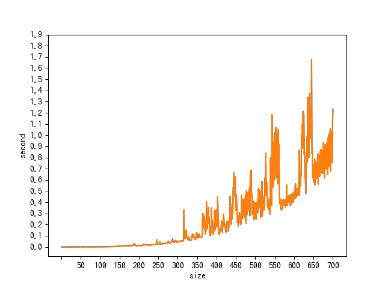
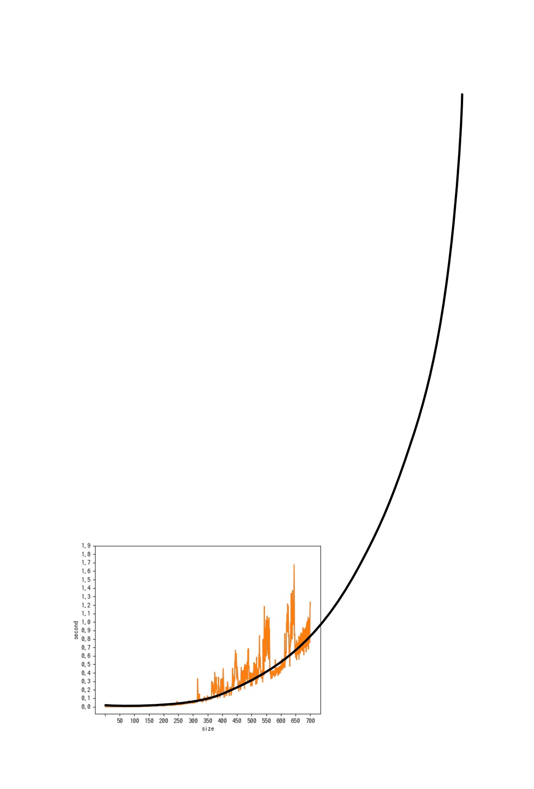
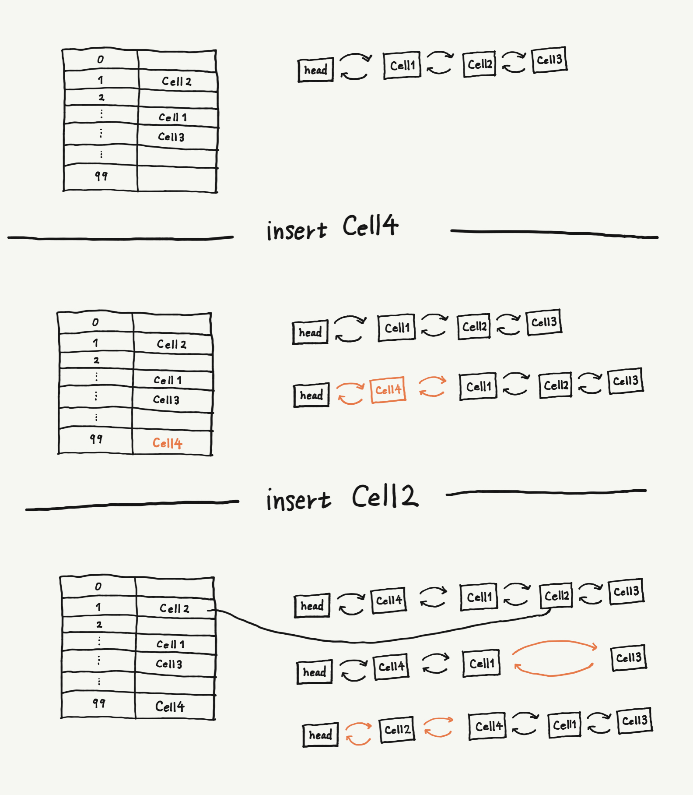

# Week2 homework

# 宿題1
### 課題文
行列積を求めるプログラムを書き、行列サイズと実行時間の関係を調べる。

### 結果
行列積を求めるアルゴリズムは、私の書いたプログラムの場合O(N^3)となった。

時間の都合上N=700までを求めたが、この後も続けていれば以下のようなグラフになることが予想される。

このグラフから、実行時間はN^3に比例していることがわかる。

# 宿題2
### 課題文
木構造を使えばO(log N)、ハッシュテーブルを使えばほぼO(1)で検索・追加・削除を実現することができるが、現実の大規模なデータベースでは木構造が使われることが多い。その理由を考えよ。
### 解答
木構造がハッシュテーブルより優れている点として以下のことが考えられる。

- ハッシュテーブルは衝突が起きた場合にO(1)ではなくなってしまうため、できる限り偏りの少ないハッシュ関数を考える必要がある。
- 衝突を減らすためには配列サイズを大きめに取る必要があるが、サイズを大きくするとメモリを多く消費する。
- ハッシュテーブルは整列された順番に取り出すことができないが、二分探索木であれば可能。

# 宿題3 & 宿題4　
### 課題文
- 与えられた<URL, Webページ>があるかないかを検索する
- もしない場合、キャッシュ内で一番古い<URL, Webページ>を捨てて、かわりに与えられた<URL, Webページ>を追加する

上の条件をほぼO(1)で実現するデータ構造を考えて実装せよ。

### 実装方針
キーをハッシュ値、値をCellクラスとしたハッシュテーブルと双方向リストを用意する。

追加命令がきた時は、ハッシュテーブルを検索し、

- 既に登録されていれば

リストから削除→リストの先頭に登録
- 登録されていなければ

Cellをインスタンス化→リストが最大サイズを超えていれば最後尾を削除する→テーブルにCellを追加

この方法にすることで、検索・追加・削除が、ハッシュの衝突が起きない時に限りO(1)になる。
今回はオープンアドレス法を利用して実装した。

# 追加課題
### 課題文
暗号的ハッシュ関数を用いた方法でも安全ではない。どうして安全ではないのか、対処するにはどうしたらいいのかを考えよ。
### 解答
考え中

# 授業後追記

### 宿題２
- データが想定より多くなった場合に、大きなデータベースとして再構築する必要がある。
- O(logN)とO(1)を比べた時に、Nによってはそこまでの差が生じない。

### 宿題3・４
実装したのはLRUと呼ばれるアルゴリズム。
トライ木を使うと常にO(1)になる。

### 追加課題
1234のような、有名なパスワードを使っているユーザを特定することができてしまう。パスワードに乱数をつけてハッシュ化することで、元のパスワードを特定することができなくなる。
