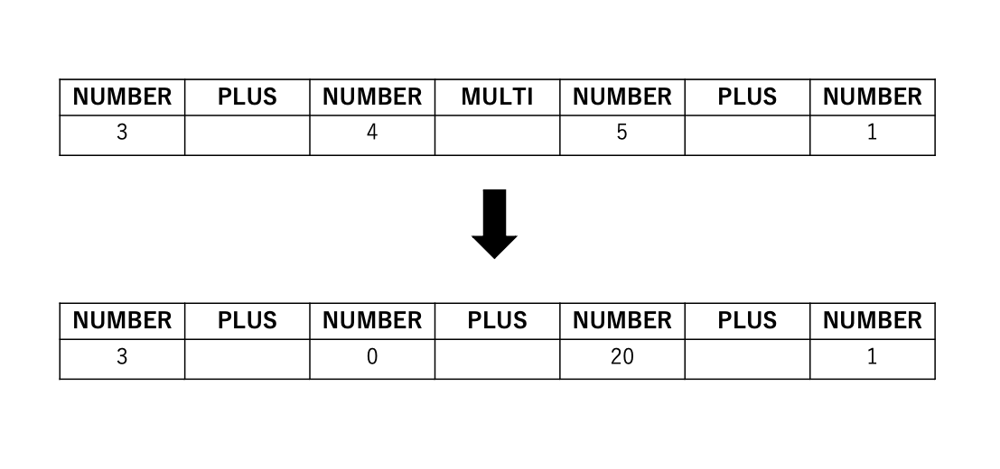

# Week3 homework

# 宿題1
### 課題文
モジュール化されたプログラムを変更して、「*」「/」に対応しよう

### 実装方針
掛け算割り算は先に計算する必要があるため、下図のように、先にtypeがMULTIかDIVIのものを計算させてから全体を計算した。

# 宿題2
### 課題文
括弧に対応しよう
例： (3.0 + 4 * (2 − 1)) / 5

### 実装方針
括弧のペアを発見するためには、クエリを前から順に見ていって)を見つけたら(を見つけるまで　)のindexから戻る。そのようにして括弧のペアを見つけ、内側を先に計算させるようにした。
