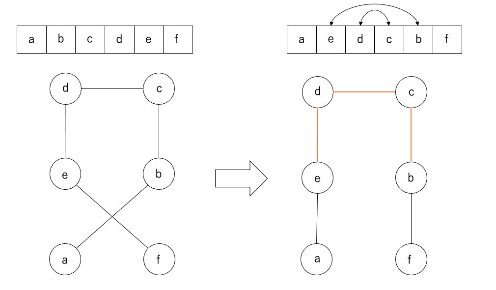

## WEEK5 HOMEWORK

### 課題
街の座標が与えられる。全ての街を通り、できるだけ最短になるような経路を出力するプログラムを書きなさい。

### ビジュアライザ
https://mayu-snba19.github.io/google-step/week5/visualizer/build/default/

### 実行方法
出力ファイル(output_{number}.csv)は
```
javac OutputGenerator.java && java OutputGenerator
```
を実行することで作成できます。
距離スコアは
```
python output_verifier.py
```
で確認できます。

### プログラム構成

- [OutputGenerator.java](https://github.com/mayu-snba19/google-step/blob/master/week5/OutputGenerator.java) : Tsp.javaを全てのinput_{number}.csvに対して動かす。
- [Tsp.java](https://github.com/mayu-snba19/google-step/blob/master/week5/Tsp.java) : 与えられたファイルに対して最短経路を求めるプログラム。
- [City.java](https://github.com/mayu-snba19/google-step/blob/master/week5/City.java) : 街の情報

### このプログラムについて
まず未訪問の街の中で最も現在の街から近い場所を選んで移動するようにして全体の経路を求めてから、交差がなくなるようにswapしていくコードを書きました。
交差をほどく際には、間の経路も全てswapする必要があります。


### 実行結果

|街数  |Greedy Score|My Score|
|---|---|---|
|N = 5|3418.10|3418.10|
|N = 8|3832.29|3832.29|
|N = 16|5449.44|4994.89|
|N = 64|10519.16|8705.44|
|N = 128|12684.06|11311.56|
|N = 512|25331.84|21726.21|
|N = 2048|49892.05|42523.97|
