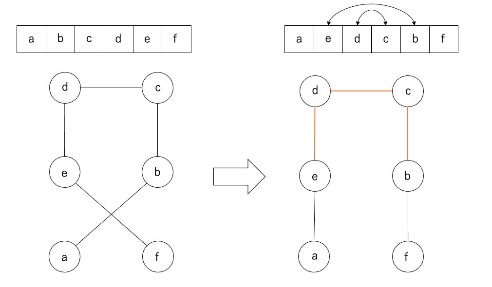

## WEEK5 HOMEWORK

### 課題

街の座標が与えられる。全ての街を通り、できるだけ最短になるような経路を出力するプログラムを書きなさい。

### 実行方法

出力ファイル(output\_{number}.csv)は

```
javac OutputGenerator.java && java OutputGenerator
```

を実行することで作成できます。
距離スコアは

```
python output_verifier.py
```

で確認できます。

### プログラム構成

- [OutputGenerator.java](https://github.com/mayu-snba19/google-step/blob/master/week7/OutputGenerator.java) : Tsp.java を全ての input\_{number}.csv に対して動かす。
- [Tsp.java](https://github.com/mayu-snba19/google-step/blob/master/week7/Tsp.java) : 与えられたファイルに対してできるだけ最短になるような経路を求めるプログラム。
- [City.java](https://github.com/mayu-snba19/google-step/blob/master/week7/City.java) : 街の情報

### このプログラムについて

まず未訪問の街の中で最も現在の街から近い場所を選んで移動するようにして全体の経路を求めてから、交差がなくなるように swap していくコードを書きました。
交差をほどく際には、間の経路も全て swap する必要があります。


その後、焼きなまし法を利用しました。焼きなまし法では、最初は距離が長くなる場合も交換して、終わりに近づくにつれ、距離が短くなる場合のみ swap するようにしました。
これによって、局所最適解に陥りにくくなります。疑似コードに直すと以下のようになります。

```
for (1からendTimeまで) {
  cost = calcCost(a,b);
  forceSwap = (endTime - t) / endTime;
  if (cost > 0 || forceSwap > random.nextDouble()) {
    swap(a,b);
  }
}
```

### 実行結果

| 街数     | Greedy Score | week5 score | week6 score(5 回実行した内の best score) |
| -------- | ------------ | ----------- | ---------------------------------------- |
| N = 5    | 3418.10      | 3418.10     | 3291.62                                  |
| N = 8    | 3832.29      | 3832.29     | 3778.71                                  |
| N = 16   | 5449.44      | 4994.89     | 4494.42                                  |
| N = 64   | 10519.16     | 8705.44     | 8561.19                                  |
| N = 128  | 12684.06     | 11311.56    | 11116.54                                 |
| N = 512  | 25331.84     | 21726.21    | 21697.62                                 |
| N = 2048 | 49892.05     | 42523.97    | 43743.29                                 |

結果として、week5 （貪欲法+2-opt）のプログラムと比べてスコアが改善されるものもあれば、改善されないものもありました。<br>
十分な時間・適切なパラメータでプログラムを走らせたら、スコアが改善される確率は高くなるのではないかと予想しています。
